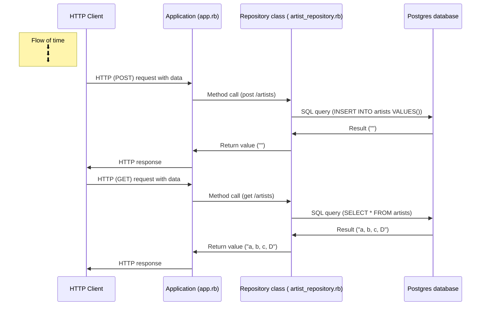

Create a sequence diagram explaining the behaviour of your 
program when a request is sent to POST /artists. Make sure 
your diagram all includes the following:

The HTTP Client
The Application class (app.rb)
The Repository class (artist_repository.rb)
The Database

The HTTP Request and the data it contains
The HTTP Response and the data it contains

<!-- Syntax:  
X->>Y: What happens
-->